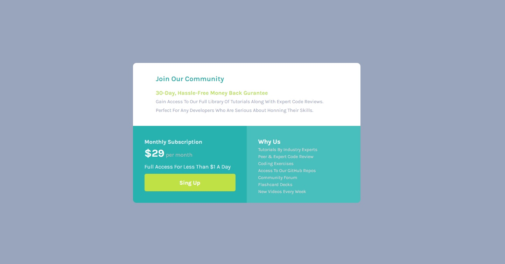

# Make-It-Real---Single-price-grid-component
MakeItReal - Trabajo01 - Octubre 18 del 2022

## Tabla de contenido

- [Taller](#Taller)
- [Resultado](#Resultado)
- [Recursos](#Recursos)
    - [Caracteristicas](#Caracteristicas)
- [Conclusiones](#Conclusiones)
## Taller
    Realizar una pagina 404 NOT FOUND segun las caracteristicas y especificaciones propuestas.

    [Taller01](https://github.com/makeitrealcamp/top-v25/tree/main/challenges/single-price-grid)

## Resultado (Desktop & Mobile)

> Desktop

> Mobile

## Recursos

Se realizo con las tecnologias:
    - Html
    - Css

La imagen fue suministrada y las caracteristicas son las siguientes:

### Caracteristicas

    Guia de Estilo:

    - Mobile: 375px
    - Desktop: 1440px

    Colores:

    Primary
    - Cyan: hsl(179, 62%, 43%)
    - Bright Yellow: hsl(71, 73%, 54%)

    Neutral
    - Light Gray: hsl(204, 43%, 93%)
    - Grayish Blue: hsl(218, 22%, 67%)

    Tipografia:

    - Family: [karla](https://fonts.google.com/specimen/Karla)
    - Weights: 400, 700
    - Font size: 16px

## Conclusiones

La realizacion del taller GRID sirve para repasar y aplicar codigo base en Html y Css, usando un repositorio, simulando un entorno corporativo entre un grupo asignado de trabajo.